\def\vec#1#2{\begin{bmatrix} {#1} \\ {#2} \end{bmatrix}}

# Problem 1
We wish to know how much memory an FSM with (say) $n$ states and transition function $\delta$ can provide.  
To answer this, consider an FSM $M_2$ (see figure) that accepts all strings over $\Sigma = \{a,b\}$ with an even number of $a$'s. Clearly, with $n=2$ states, it can "remember" $\#a \% 2$, in the sense that the current state can tell us this value.  

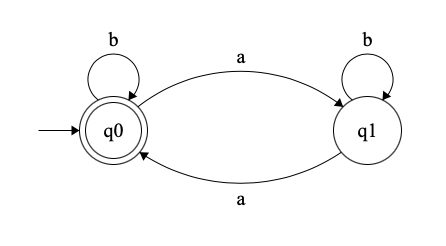  

Similarly, we can construct $M_3$ (see figure) that accepts all strings with $3k$ occurrences of $a$ (where $k$ is an integer). Now, with $n=3$ states, it can "remember" $\#a \% 3$, in the same way that $M_2$ could.

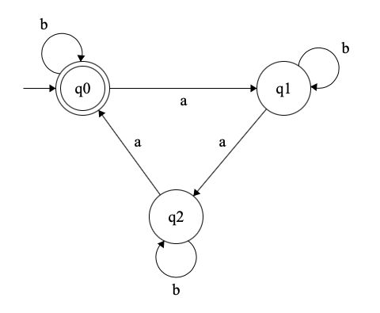  

We can continue this process, creating for any $n$ an FSM $M_n$ that accepts all strings with $kn$ occurrences of $a$, where $k$ is an integer. Such a machine will be able to remember $\#a \% n$ from its state; this value always lies in $\{0, 1, \dots, n-1\}$. Therefore the machine has a memory of $\log_2n$ bits.

# Problem 2
We have $C_n \{\langle x \rangle \mid \rangle x \langle \text{ is the binary encoding of an integer multiple of } n$\}$. We wish to show that $C_n$ is regular for all $n \in \mathbb{N}$.  
We can prove this by constructing an NFA $N$ that recognises $C_n$ for any $n$. We will first construct a DFA $D_n$ to recognise all $x$ in big-endian form, and show how to convert it to an NFA $N$ that recognises the little-endian form.  

First, consider the sequence $[2^0 \mod n, 2^1 \mod n, \cdots]$. Note (1) that every element in the sequence uniquely determines the next, and (2) that every element in the sequence belongs to $\{0, 1, \dots, n-1\}$. Together, these two facts imply that the sequence repeats after $k$ elements, where $k < n$. Call this repeating subsequence $[a_0, a_1, \dots, a_{k-1}]$, where $a_i = 2^i \mod n$.  

Let the input number be $x = x_0 \cdot 2^0 + x_1 \cdot 2^1 + \cdots + x_m \cdot 2^m$. Then $x = x_0 \cdot a_0 + x_1 \cdot a_1 + \cdots \mod n$, where the $a_i$ multiplied by the bits cycle every $k$ positions.  

Now we can construct $D_n$. For each $a_i$, add $n$ states $\{q_{a_i}^0, q_{a_i}^1, \dots, q_{a_i}^{n-1}\}$ to the automaton.  
The automaton will keep track of the remainder obtained when its input so far is divided by $n$. When the automaton is on state $q_{a_i}^j$, it is interpreted as follows: until now, the input $\mod n$ is equal to $j$, and a bit of weight $a_i$ is the next one to be read.   

Given this interpretation, we can define the set $F$ of accepting states to be all states of the form $q_{a_i}^0$. The start state will be $q_{a_0}^0$.  
The transitions can also be deduced accordingly:
$$\delta(q_{a_i}^j, b) = q_{a_{i+1}}^{j+b \cdot a_i (\mod n)},$$
as the new bit $b$ adds $b \cdot a_i \mod n$ to the existing remainder, and the next bit will have weight $a_{i+1}$ (or $a_0$ if the last one was $a_{k-1}$). This completes the construction of $D_n$.  

The figure shows $D_3$. The cycle of $a_i$ is $[1, 2]$; $q_1^i$ are marked as $r_i$, and $q_2^i$ as $s_i$ for convenience.  

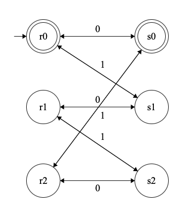  

Now, we need to construct the NFA $N$ to recognise the corresponding little-endian representations. Note that any little-endian representation is simply the reverse of the big-endian representation of the same number; thus $N$ needs only to accept the reverse of all strings that $D_n$ accepts.  
To construct such an $N$, we first convert $D_n$ to an NFA $N'$ with a single accept state $q_f$ (see Problem 7 below). Then, we let $N$ be identical $N'$ except that:

* the start state of $N$ is the only accepting state of $N'$
* the accepting state of $N$ is the start state of $N'$
* all transitions in $N$ are reversed.

The automaton $N$ for the case of $n=3$ is shown below (constructed from $D_3$ by following the above steps).  

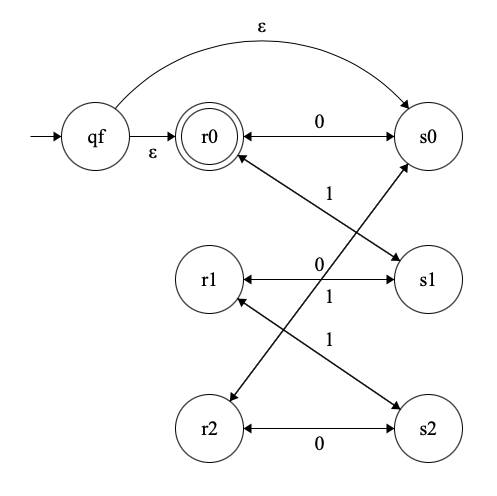  

# Problem 3
We have
$$\Sigma_2 = \left\{ \vec00, \vec01, \vec10, \vec11 \right\},$$
and
$$\vec{u_1}{u_2} \cdot \vec{v_1}{v_2} = \vec{u_1v_1}{u_2v_2}.$$
We let $w(r_1)$ and $w(r_2)$ represent the first and second rows of $w \in \Sigma_2^ *$ respectively.  

We wish to prove that $A = \{w \in \Sigma_2^ * \mid w(r_1) = 2w(r_2) \}$, where $w(r_i)$ represent numbers in big-endian form.  
We will do this by constructing a regular expression $R$ that represents all such $w$.  

First, note that for any number $x$ that has 0 in its $n$ least significant positions ($n \geq 0$), $2x$ also starts with $n$ zeroes. Therefore,
$$R = {\vec00}^ * R'.$$

Next, say that in $x$, 1 first occurs in the $i^\text{th}$ position. Then we know that $2x$ has a 0 in the $i^\text{th}$ position; furthermore, a 1 carries over to the $(i+1)^\text{th}$ position.  
If this position is occupied by a 0 in $x$, then there is no carry-over and we can restart as if $x$ and $2x$ began from the $(i+2)^\text{th}$ position. If it has a 1, however, the 1 of $2x$ carries over *again* to the $(i+2)^\text{th}$ position, and we must repeat this analysis.  
Thus, the first 1 in $x$ corresponds to a 0 in $2x$. If the next $m$ bits of $x$ are also 1s, the next $(m+1)$ bits of $2x$ are also ones. The last consecutive 1 in $2x$ corresponds to a 0 in $x$.  

As noted above, if there is no carry-over in a certain position, we can treat that position as the start of the number. Thus we can design the regex as a Kleene star operation on an expression that accounts for carry-over within itself, as follows.
$$R = \left( \vec00^ * \vec01 \vec11 ^ * \vec10 \right)^*.$$

We have shown that $A = L(R)$, *i.e.*, $A$ is a regular language, QED.

# Problem 4

# Problem 5
Let the automaton given be $M$. It has three states, $q_1$, $q_2$ and $q_3$, of which $q_1$ and $q_3$ are the accept states and $q_1$ is the start state.  

We begin by converting it to a GNFA $G$ by adding a new start state and a new final state with $\varepsilon$-transitions.

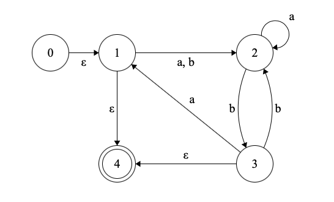

For the first iteration, we let $q_\text{rip} = q_1$. It has two incoming arrows (from $q_0$ and $q_3$), two outgoing ones (to $q_4$ and $q_2$), and no self-directed arrows. Thus, according to the algorithm, we remove it and add the required new transitions to make the GNFA $G_1$.

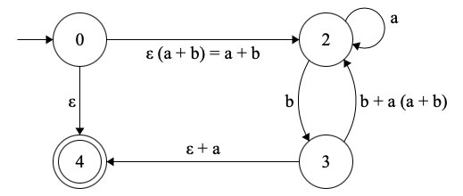

Next, we let $q_\text{rip} = q_3$. It has one incoming arrow (from $q_2$), two outgoing arrows (to $q_2$ and $q_4$), and no self-directed arrows. Thus we make the next GNFA $G_2$.

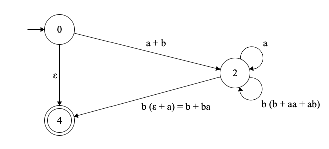

Finally, we make $q_\text{rip} = q_2$ and appropriately edit the transition from $q_0$ to $q_4$ in $G_3$, which will then contain our required regular expression.

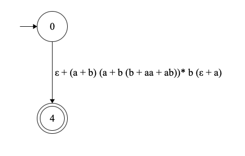

This gives us
$$R = \varepsilon + (a+b)(a+b(b+aa+ab))^*b(\varepsilon + a),$$
which is the regular expression we require.

# Problem 6
We define a cute number as any number which has 1s in all odd-numbered positions of its binary representation (with the MSB being position 1). The set of cute numbers is called $S$.  

We will proceed by proving that any integer $n \geq 3$ can be written as the sum of three cute numbers. From here, the problem becomes simple.  

We will divide the cute numbers into two sets – those with an even number of bits $E$ and those with an odd number of bits $O$. For the rest of the proof, we will use the word *digit* to indicate a numeral in the base-4 representation of a number.  
Now, consider the digits of an arbitrary number $e \in E$. Since $e$ has an even number of *bits*, its last bit can be either 0 or 1, but its second-last bit must be 1. We can therefore conclude that $e$ only contains the *digits* 2 or 3 in all positions. For example, $(1010111011)_2 = (22323)_4 = 699$ is in $E$.  
Next, consider an arbitrary $o \in O$. It has an odd number of bits; therefore its last bit must be 1, and its second-last bit can be either 0 or 1. Thus its digits are all either 1 or 3; moreover, it must begin with 1. For example, $(10111011101)_2 = (113131)_4 = 1501$ is in $O$.  

Let $n$ be an arbitrary number greater than 3. Let $\alpha, \beta, \gamma \in S$ be three cute numbers such that $\alpha + \beta + \gamma = n$. We enforce two additional constraints:

* $\alpha, \beta \in O$ and $\gamma \in E$;
* the digits of $\alpha$ are all 1s.

Now, we will construct $\alpha, \beta, \gamma$ from $n$.  

Consider the possible sums of three corresponding digits, one of each of $\alpha, \beta, \gamma$. From $\alpha$, we have only 1; from $\beta$, only 1 or 3; and from $\gamma$, only 2 or 3. Thus we have the following sums.
$$\begin{split}
1 + 1 + 2 & = 10 \\
1 + 1 + 3 & = 11 \\
1 + 3 + 2 & = 12 \\
1 + 3 + 3 & = 13 \end{split}$$

Thus, for any digit of $n$, we can assign digits to $\alpha, \beta, \gamma$ in that position so that they give the correct digit on summing. We must, however, take care of carry-over digits. We can formalise this procedure in this way . Here, $c$ represents the carry-over to the next digit, $c'$ the carry-over from the previous digit; the numbering of digits starts from 0 at the LSD.
$$(\alpha_0, \beta_0, \gamma_0) = \begin{cases}
(1,1,2) & n_0 = 0 \\
(1,1,3) & n_0 = 1 \\
(1,3,2) & n_0 = 2 \\
(1,3,3) & n_0 = 3 \end{cases}$$

$$(\alpha_i, \beta_i, \gamma_i) = \begin{cases}
(1,1,2) & n_i - c' = 0 \mod 4 \\
(1,1,3) & n_i - c' = 1 \mod 4 \\
(1,3,2) & n_i - c' = 2 \mod 4 \\
(1,3,3) & n_i - c' = 3 \mod 4 \end{cases}$$

$c$ can be found in all cases by finding $\alpha_i + \beta_i + \gamma_i + c' - n_i$ and taking its second-least significant digit.

However, the last two digits of $n$ (*i.e.* the most significant two digits) pose a problem. We cannot arbitrarily carry-over at the second-last (second-most significant) digit, in case the carry exceeds the digit. Let $t$ represent the value of the last two digits and $c'$ the carry-over from the third-last position.  
If $t - c' = 2$, then let the digits of $\alpha$ and $\beta$ be 1.  
If $t - c' = 3$, then let the digit of $\beta$ be 1 and $\gamma$ be 2.  
If $t - c' \in \{10,11,12,13\}$, then we can assign the digits of $\alpha, \beta, \gamma$ as above.  
If $t - c' \in \{20,21,22,23\}$, then we can assign the digits in that position as above, and let the next digit of $\beta$ be 1.  
If $t - c' \in \{30,31\}$, then we can assign the digits of $\alpha, \beta, \gamma$ as above, and let the next digit of $\gamma$ be 2.  
If $t - c' \in \{32,33\}$, then we can assign the digits of $\alpha, \beta, \gamma$ as above, and let the next digit of both $\alpha$ and $\beta$ be 1.  

It can be verified that the above assignment accounts for all $n > 3$. If $n = 3$, letting $\alpha = \beta = \gamma = 1$ satisfies the constraints.  

For example, consider $n = 2718283141$. The base-4 representation of $n$ is $2202001123112011$. We can follow the above procedure to get:
$$\begin{split}
n_0 = 1 \implies (\alpha_0, \beta_0, \gamma_0, c) &= (1,1,3,1) \\
n_1 - c' = 0 \implies (\alpha_1, \beta_1, \gamma_1, c) &= (1,1,2,1) \\
n_2 - c' = 3 \implies (\alpha_2, \beta_2, \gamma_2, c) &= (1,3,3,2) \\
n_3 - c' = 0 \implies (\alpha_3, \beta_3, \gamma_3, c) &= (1,1,2,1) \\
n_4 - c' = 0 \implies (\alpha_4, \beta_4, \gamma_4, c) &= (1,1,2,1) \\
n_5 - c' = 0 \implies (\alpha_5, \beta_5, \gamma_5, c) &= (1,1,2,1) \\
n_6 - c' = 2 \implies (\alpha_6, \beta_6, \gamma_6, c) &= (1,3,2,1) \\
n_7 - c' = 1 \implies (\alpha_7, \beta_7, \gamma_7, c) &= (1,1,3,1) \\
n_8 - c' = 0 \implies (\alpha_8, \beta_8, \gamma_8, c) &= (1,1,2,1) \\
n_9 - c' = 0 \implies (\alpha_9, \beta_9, \gamma_9, c) &= (1,1,2,1) \\
n_{10} - c' = 3 \implies (\alpha_{10}, \beta_{10}, \gamma_{10}, c) &= (1,3,3,2) \\
n_{11} - c' = 2 \implies (\alpha_{11}, \beta_{11}, \gamma_{11}, c) &= (1,3,2,2) \\
n_{12} - c' = 0 \implies (\alpha_{12}, \beta_{12}, \gamma_{12}, c) &= (1,1,2,1) \\
n_{12} - c' = 0 \implies (\alpha_{12}, \beta_{12}, \gamma_{12}, c) &= (1,1,2,1) \\
n_{13} - c' = 3 \implies (\alpha_{13}, \beta_{13}, \gamma_{13}, c) &= (1,3,3,2) \\
t - c' = 20 \implies (\alpha_{14},\beta_{14},\gamma_{14}) &= (1,1,2), \beta_{15} = 1 \end{split}$$

Thus,
$$\begin{split}
\alpha &= (11111111111111111)_4 = 357913941 \\
\beta  &= (1131331113111311)_4  = 1576367477 \\
\gamma &= (232232232222323)_4   = 784001723 \end{split}$$

We can verify that $357913941 + 1576367477 + 784001723 = 2718283141$, and that each of $\alpha, \beta, \gamma$ are cute numbers as
$$\begin{split}
\alpha &= (10101010101010101010101010101)_2 \\
\beta &= (1011101111101010111010101110101)_2 \\
\gamma &= (101110101110101110101010111011)_2 \end{split}$$

## Part 1
We have shown that all numbers $n \geq 3$ are the sum of 3 cute numbers. Thus, we need an NFA that will accept all these numbers. Such an NFA can be designed as in the figure.  

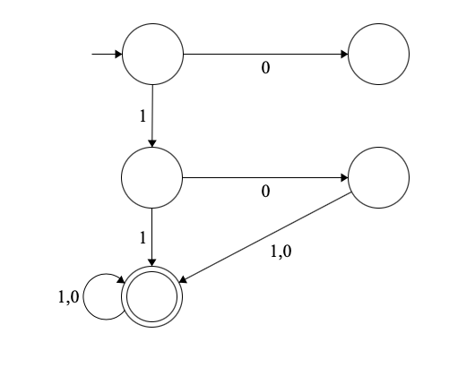  

## Part 2
We can trace the runs of 333 and 420 through $T$ to prove that they are sums of three cute numbers.  

The binary representation of 333 is 101001101. After three characters, it reaches the accept state of $T$ and does not leave it.  

The binary representation of 420 is 1101001000. After two characters, it too reaches $T$'s accept state and stays there.  

We can use the procedure described above to find the cute numbers as well.  

We know that $333 = (11031)_4$, which makes
$$\begin{split}
\alpha &= (111)_4  = (10101)_2    = 21 \\
\beta  &= (1331)_4 = (1111101)_2  = 125 \\
\gamma &= (2323)_4 = (10111011)_2 = 187, \end{split}$$
as required.  

Also, $420 = (12210)_4$, which makes
$$\begin{split}
\alpha &= (1111)_4 = (1010101)_2  = 85 \\
\beta  &= (1111)_4 = (1010101)_2  = 85 \\
\gamma &= (3322)_4 = (11111010)_2 = 250, \end{split}$$
as required.

# Problem 7
We wish to prove that given any NFA $N$, we can convert it to an NFA $N'$ that has only one final state.  
We claim that $N'$ can be constructed from $N$ by adding a new state $q_f$ with $\varepsilon$-transitions from each of the accepting states $q \in F$ of $N$.  

To prove this, consider any string $w \in L(N)$. We know that since it belongs to $L(N)$, it has a run on $N$ which ends at some $q \in F$.  
Therefore, if we give it as input to $N'$, it will similarly end in one of those states (as $N'$ has all the transitions that $N$ does). An $\varepsilon$-transition can then be added to the run to take it to $q_f$, proving that $w \in L(N')$.  

Conversely, suppose that $w \in L(N')$. There is obviously a run of $w$ on $N'$ that ends in $q_f$; however, by the definition of $N'$, all the transitions leading to $q_f$ are $\varepsilon$-transitions, which add nothing to $w$. We now distinguish two cases:

1. $w = \varepsilon$. In this case, either there is a run for $\varepsilon$ from the start state to one of $q \in F$, or the start state itself belongs to $F$. In either case, $w \in L(N)$.  
2. $w \neq \varepsilon$. This means that there is the run for $w$ passes through some $q \in F$ before reaching $q_f$ via an $\varepsilon$-transition. Therefore, if this $q \in F$ is an accepting state, $w$ can be accepted without reaching $q_f$. Hence $w \in L(N)$.

We have proved that $L(N) = L(N')$, which means that $N$ and $N'$ are equivalent, QED.

# Problem 8
## Part 1
We have $L = \{ w \in \{\{, \}\}^* \mid w \text{ has balanced parantheses}\}$. We wish to show that $L$ is *not* regular.  

To do this, let us assume that $L$ is regular and derive a contradiction.  
First, if $L$ is regular, it must satisfy the pumping lemma. Let $p$ be the pumping length; then any string $w \in L$ such that $|w| \geq p$ can be written as $w = xyz$, where $|xy| \leq p$, $|y| \geq 1$, such that $xy^iz \in L$ for all $i \in \mathbb{N}$.  

However, consider the string $w = p$ opening braces followed by $p$ closing braces. Clearly, $w \in L$. Now, if $w = xyz$ and $|xy| \leq p$, then $xy$ (and therefore $y$ alone) consists only of opening braces.  

Then $w' = xy^0z = xz$ contains $p-|y|$ opening braces and $p$ closing braces. Since $|y| \geq 1$, $p-|y| < p$; this means that $w'$ does *not*  have balanced parantheses, so $w' \notin L$, which is a contradiction.  

Therefore, $L$ is not regular, QED.

## Part 2
We have $L = \{ 1^{n!} \mid n \in \{0, 1, 2 \dots \} \}$. We wish to show that $n$ is *not* regular.  

First, we note that $|w| = n!$ for some $n \in \mathbb{N}$ for all $w \in L$. This will allow us to prove that strings in $L$ cannot, in general, be pumped.  

Suppose that $L$ is regular, and that $p$ is the pumping length. Let $w = xyz$ be some string in $L$ such that $|w| \geq p$, $|xy| \leq p$, and $|y| \geq 1$. Then $s_i = xy^iz \in L$ for all $i$.  

Now, clearly the lengths $|s_i|$ are in AP. We also know that $|s_i| = p_i!$ for some $p_i \in \mathbb{N}$. Therefore $p_{i+1}! - p_i! = |y|$ for all $i$; thus the $p_i$ grow without bound.  
However, $n! - (n-1)! = (n-1) \cdot (n-1)!$. Thus the difference between successive factorials also grows arbitrarily large; this means that there is some $m \in \mathbb{N}$ such that $m! - (m-1)! > |y|$. Then, if $s_k = 1^{(m-1)!}$, then $|s_{k+1}| < m!$, which implies that $s_{k+1} \neq 1^{n!}$ for any $n \in \mathbb{N}$.  

We have a contradiction. Thus $L$ cannot be pumped and is therefore not a regular language, QED.

# Problem 9
We wish to convert an arbitrary right linear grammar $R$ to a left linear grammar $L$. We will proceed by transforming $R$ to an NFA $N$ first, and then converting the NFA to a left linear grammar.  

Since $R$ is a right linear grammar, the rules in $R$ are of three forms:
$$\begin{split}
V &\to T V' \\
V &\to T, \text{ or} \\
V &\to \varepsilon, \end{split}$$
where $T$ represents a terminal and $V$ and $V'$ represent variables.  

To convert $R$ to $N$, first we create a state $q_V$ for each variable $V$ of $R$. We mark the state $q_S$ corresponding to the start variable $S$ as the start state. We also add a special final state $q_f$.  
Next we construct the transition function $\delta$. For a rule of the type $V \to TV'$, we let $T \in \delta(V,V')$. For a rule of the type $V \to T'$ (where $T'$ is either a terminal or $\varepsilon$), we let $T' \in \delta(V, q_f)$. This completes the construction.  

Note that an equivalent NFA to $R$ can be constructed without the extra state $q_f$; however, this addition makes the transformation to $L$ more convenient. The algorithm for this transformation is as follows.  

As defined, $N$ has only one final state. We create a variable $V_i$ for each state $q_i \in Q$ of $N$ and let the start variable $S$ correspond to the final state $q_f$ of $N$.  
Next, for each transition $\delta(q_s, q_t) = \{T_1, T_2, \dots, T_k\}$, we add $k$ rules to $L$. These rules will be given by
$$V_t \to V_s T_i$$
for each $i \in \{1, \dots, k\}$.  
We also add a rule $V_0 \to \varepsilon$ (where $V_0$ is the variable corresponding to the start state $q_0$).  

However, $\varepsilon$-transitions cause a problem; rules of the form $V \to V' \varepsilon$ are not allowed in $L$. To solve this, we eliminate these rules by the following procedure for each such rule:  
Identify all rules with $V'$ on the left side; let these rules be $V' \to A_1$, $V' \to A_2$, and so on (where each $A_i$ is either a terminal or a variable followed by a terminal). We eliminate $V \to V'$ and replace it with $V \to A_i$ for all $A_i$.  

Let us consider the example of the right linear grammar that generates all strings over $\Sigma = \{a, b\}$ that have an even number of $a$'s. The rules of $R$ are as follows:
$$\begin{split}
S &\to bS \mid aT \mid \varepsilon \\
T &\to bT \mid aS \end{split}$$

Then the equivalent NFA $N$ is as shown in the figure.

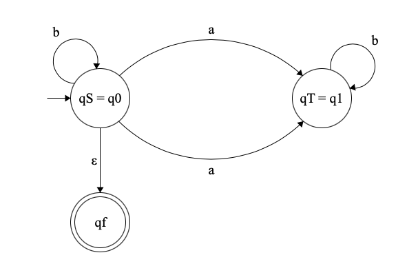

Now, we convert the NFA to a left linear grammar with variables $V_0$, $V_1$ and $S$. The rules then become:
$$\begin{split}
S &\to V_0 \varepsilon \\
V_0 &\to V_0 b \mid V_1 a \mid \varepsilon\\
V_1 &\to V_1 b \mid V_0 a \end{split}$$

And after eliminating the first rule (which is not allowed in $L$),
$$\begin{split}
S &\to V_0 b \mid V_1 a \mid \varepsilon \\
V_0 &\to V_0 b \mid V_1 a \mid \varepsilon\\
V_1 &\to V_1 b \mid V_0 a \end{split},$$

since we know that $\varepsilon \varepsilon = \varepsilon$.

It can be verified that this grammar is equivalent to $R$.

# Problem 10
## Part 1
The NFA for the given regular expression
$R = (aa)^* + b^* + a^*b^*$
can be constructed in the normal way. The start state $q_0$ and it has $\varepsilon$-transitions leading to each state for the three smaller regexes connected by $+$.  
The portion for $(aa)^*$ includes two states. One of them is the accept state; this accounts for the Kleene star applied to the bracketed expression.  
The $b^*$ part is accounted for by the self-directed transition on $q_2$.  
The $a^*b^*$ part is represented by the two states $q_5$ and $q_6$ with the $\varepsilon$-transition and the self-loops.  

The NFA constructed is shown in the figure.

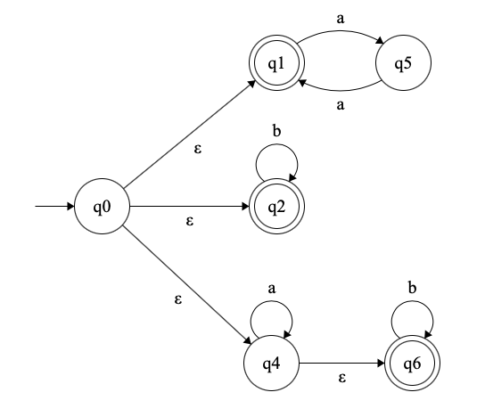

## Part 2
Given the initial $\varepsilon$-transitions, we start with the state $q_{1234}$, which corresponds to the set $\{q_1, q_2, q_3, q_4\}$.  

On input $a$, $q_2 \to \{q_5\}$ and $q_2 \to \{q_4, a_6\}$; thus the next state in the DFA is $q_{456}$. 
On input $b$, $q_3 \to \{q_3\}$ and $q_4 \to \{q_6\}$. Thus the next state is $q_{36}$.  

For $q_{456}$, on input $a$, we have $q_4 \to \{q_4, q_6\}$ and $q_5 \to \{q_2\}$. Therefore the next state is $q_{246}$.  
On input $b$, $q_4 \to \{q_6\}$, which makes the next state $q_6$.  

From $q_{246}$, $a$ causes $q_2 \to q_5$ and $q_4 \to \{q_4, q_6\}$. Thus $a$ takes it back to $q_{456}$.  
The input $b$ takes only $q_6 \to \{q_6\}$; thus here too the next state is $q_6$.  

Now we consider $q_{36}$. On input $a$, no transitions are possible, so the next state is $q_{\emptyset}$.  
On input $b$, $q_3 \to \{q_3\}$ and $q_6 \to \{q_6\}$, so this forms a self-directed transition.  

Finally, we consider $q_6$. On input $a$, this leads to $q_\emptyset$, and on input $b$, it can only go back to itself. Trivially, $q_\emptyset$ loops back to itself on any input.  

The accept states are $q_{1234}, q_{456}, q_{246}, q_{236}$, and $q_6$. The DFA formed is shown in the figure.

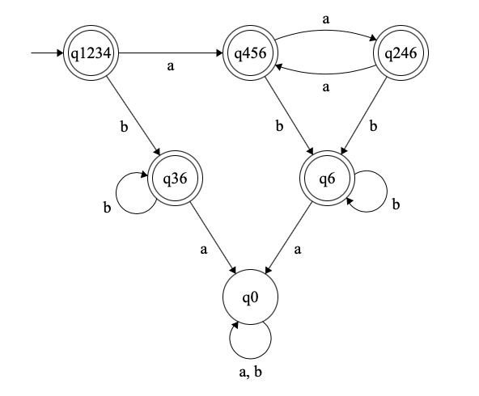
