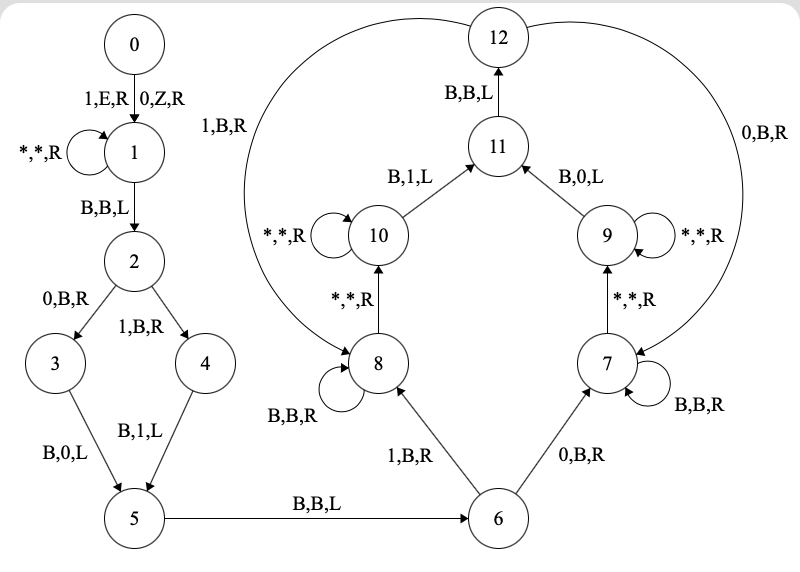
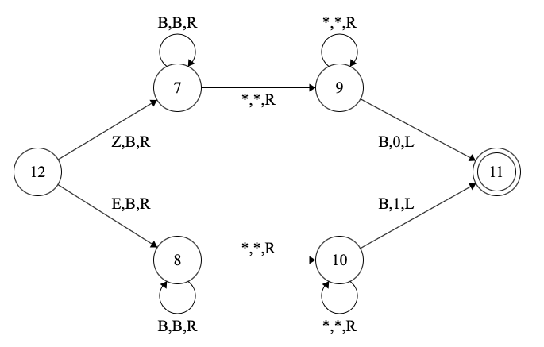

\def\vec#1#2{\begin{bmatrix} {#1} \\ {#2} \end{bmatrix}}

# Problem 1
We wish to find the number of configurations a TM with tape alphabet cardinality $\tau$ and states $Q$ can have.  

We know that a TM has an infinitely long tape, and any cell can contain any symbol from $\Gamma$. Thus, it has an infinitely large configuration space.

# Problem 2
The Turing machine shown in Figure 1 does takes a string $w \in \{0,1\}^n, n \in \mathbb{N}$, and outputs $w^R$.  

It has the input alphabet $\Sigma = \{0,1\}$, and tape alphabet $\{0, 1, Z, E, B\}$. $Z$ and $E$ can be interpreted as special marks on 0 and 1 to indicate the beginning of the tape.  

The TM starts at state 0 and replaces the first symbol on the tape with $Z$ if it is 0, and $E$ if it is 1. It then finds the last symbol, erases it, and rewrites it in the cell immediately to the right.  
Next, it finds the last remaining symbol of the input, erases it, and rewrites it to the right of the last symbol it wrote. It repeats this until it finds $Z$ or $E$, and then stops and enters an accept state.  

Note that (i) the diagram has been split in two for convenience; state 12 in the first part and state 12 in the second part are the same, and (ii) `*,*,R` is used as shorthand for both transitions `0,0,R` and `1,1,R` together.

  

# Problem 3
We have a context-free language $C$, a regular language $R$, and languages $L_1$ and $L_2$ defined as $C - R$ and $R - C$ respectively.

## Part 1
We wish to decide if $L_1 = C - R$ is context-free or not.  

First, note that since $R$ is regular, so is $\overline{R}$. Also, $C - R = C \cap \overline{R}$, which means that $L_1$ is the intersection of a CFL with a regular language, and is therefore context-free.  

This can be proved by constructing a product PDA $X$ for $L_1$, whose states are marked $(q_i, r_j)$, for all states $q_i$ of the PDA recognising $C$, and all states $r_j$ of the DFA recognising $\overbar{R}$. For all transitions $\delta(q_i, a, b) = (q_{i'}, c)$ in the PDA for $C$, and $\delta(r_j, a) = r_{j'}$ in the DFA for $\overbar{R}$, we have the transition $\delta((q_i,r_j),a,b) = ((q_{i'}, r_{j'}), c)$ for $X$.  

Thus, $L_1$ **is** context-free.

## Part 2
We wish to decide if $L_2 = R - C$ is context-free or not.  

Let $\Sigma$ be any arbitrary finite set, which will be the alphabet for $R$ and $C$. Let $R = \Sigma^*$ and $C$ be any context-free language whose complement is *not* context-free. We know such a language exists, as CFLs are not closed under complementation.  

Now, $L_2 = R - C = \Sigma^* - C = \overline{C}$, which, by assumption, is not a CFL.  

Therefore, $L_2$ is **not** context-free.

# Problem 4
We need a language that is not context-free but satisfies the pumping lemma for CFLs. We will first prove that the language we present satisfies the pumping lemma, and then prove that it is not context-free.  

Let
$$L = \{0^m 1^n \#^+ 2^{mn} \mid m, n \in \mathbb{N}\},$$
where $c^+$ means $cc^*$, *i.e.*, at least one $c$.  

Now, we can show that this language satisfies the pumping lemma, with pumping length $p = 4$ (all strings can in fact be pumped; 4 is the length of the shortest string in the language).  
Consider an arbitrary string $w = 0^m1^n\#^k2^{mn}$, where $m, n, k \in \mathbb{N}$. We let
$$\begin{split}
u &= 0^m1^n, \\
v &= \#, \\
x &= \varepsilon, \\
y &= \begin{cases} \#^{k-1} & k \leq p \\ \#^{p-1} & k > p, \end{cases} \\
z &= \begin{cases} 2^{mn} & k \leq p \\ \#^{k-p}2^{mn} & k > p, \end{cases} \end{split}$$

which is allowed as $|vy| \geq 1$, $|vxy| \leq p$. Informally, we let $y$ be as long as possible, while containing only $\#$'s, and without letting $|vxy|$ exceeding $p$.  

Now, if $k \leq p$:
$$w_i = 0^m1^n\#^{ik}2^{mn},$$
as $v^i$ contributes $i$ and $y^i$ contributes $i(k-1)$ $\#$'s. Clearly, $w_i \in L$.  
If $k > p$:
$$w_i = 0^m1^n\#^{ip+k-p}2^{mn},$$
as $v^i$ contributes $i$, $y^i$ contributes $i(p-1)$, and $z$ contributes $k-p$ $\#$'s. Here too, $w_i \in L$.  
Thus, we have shown that $L$ satisfies the pumping lemma for CFLs.  

Now, we need to prove that $L$ is not context-free. Suppose that it is; then consider the PDA $P$ that recognises $L$. Let us alter it to create a PDA $P'$, by changing all transitions that read $\#$ from the input string to ones that read $\varepsilon$. In effect, we replace $\#$ with $\varepsilon$.  
This PDA $P'$ will recognise $L' = \{0^m1^n2^{mn} \mid m, n \in \mathbb{N}\}$, as the PDA cannot read $\#$ anymore. However, this language is not context-free. If it were, let $p$ be the pumping length and consider $w = 0^p1^p2^{p^2}$.  
Clearly, $vxy$ cannot be restricted to only 0 and 1, as the number of 2's would remain the same, while the number of 0's and 1's increase. Thus, let $vy$ together contain $k$ 1's and $l$ 2's. Now, pumping gives us $0^p1^{p+ik}2^{p^2 + il}$. For this to be in $L'$, $p(p+ik) = p^2 + pik = p^2 + il$, which means that $l = pk$, which is obviously not generally true.  

Therefore, $L'$ is not a CFL, which means $L$ cannot be either, QED.

# Problem 5
We want to show that a non-deterministic PDA that has access to two stacks can simulate a Turing machine.  

This can be done by using the pair of stacks to simulate the tape. Let us name the stacks $s_1$ and $s_2$. Intuitively, we can consider the top of $s_1$ the "current cell", moving to the right as popping from $s_2$ and pushing to $s_1$, and moving to the left as the opposite.  

More concretely, let $T = (Q_T, \Sigma_T, \Gamma_T, \delta_T, q_{0T}, q_\text{accept}, q_\text{reject})$ be a Turing machine. We will construct a PDA $P = (Q_P, \Sigma_P, \Gamma_P, \delta_P, q_{0P}, F_P)$ with two stacks $s_1, s_2$ that simulates $T$.  

First, let
$$\begin{split}
Q_P &= Q_T \cup \{q_{0P}, q_{1P}\} \\
\Sigma_P &= \Sigma_T \\
\Gamma_P &= \Gamma_P \\
F &= \{q_\text{accept}\}. \end{split}$$

We can use $q_{0P}, q_{1P}$ to read the input, and then the rest of the states will simulate the TM.  

More concretely, at $q_{0P}$, $P$ reads each symbol and pushes it onto $s_1$. When the input is completed, it pops each symbol (except the last) off $s_1$ and pushes it onto $s_1$. Now $P$'s configuration simulates $T$'s initial configuration.  

Then, when $\delta_T$ reads a symbol $a$ from the tape, $\delta_P$ reads one from the top of $s_1$. If $T$'s head moves to the left, $P$ pops from $s_1$ and pushes on $s_2$; if it moves to the right, it pops from $s_2$ and pushes to $s_1$. The state transitions are exactly as in $\delta_T$.  

Thus, we have shown how to simulate a Turing machine $T$ with a PDA $P$ that uses two stacks.

# Problem 6
We need to show that a TM $M_1$ whose tape is an infinite 2D grid can be simulated by a TM $M_2$ with an ordinary one-dimensional tape. We will provide a rough, high-level description of the working of $M_2$.  

First, we will number each cell of $M_1$'s tape. We label the starting cell as 0; then we write the numbers 1-8 on the eight cells immediately surrounding it, clockwise starting from the cell above 0. We then label the cells around these eight as 9-24, starting from the cell above 0 and going clockwise. In this manner, we assign a number to every cell of the 2D grid.  
Now, we number each *alternate* cell of $M_2$'s tape with a number, starting from the second one. Thus the starting cell is unmarked; the one to its right is cell 0, the one two places to the right of 0 is 1, and so on.  

We are now in a position to describe the working of $M_1$. The initial configuration is set by filling the same symbol in cells with the same number, and filling the alternate empty cells with a special symbol (which is not in $\Gamma$), say $\#$. In addition, the starting cell is labelled $\overline{\#}$. $M_2$ starts with its head on cell 0.  

Now, $M_2$ reads and writes under the same conditions as $M_1$, as dictated by its transition function. The only uncertainty comes from the possibility of $M_1$ moving in four different directions.  
Note, however, that the way we have numbered the cells of $M_2$ means that there is a clear algebraic relation between the number of a cell and the numbers of its neighbours. As an example, consider the function $u$ that takes an index $i$ to the index of the cell above it:
$$u(i) = (1 \cdot p(i,0)) + (0 \cdot p(i,5)) + (f(i) \cdot (1 - p(i,0)) \cdot (1-p(i,5))),$$
where $p$ is an indicator function defined as
$$p(i,j) = 2^{(i-j)^2} \mod 2$$
and $f$ is defined as
$$\begin{split}
f(i) = (i + 8k) &\cdot \left\lfloor\frac{8-t}7\right\rfloor + \\
(i - 1) &\cdot \left( \left\lfloor\frac{8-t}5\right\rfloor - \left\lfloor\frac{8-t}7\right\rfloor \right) + \\
(i - 8k + 4) &\cdot \left( \left\lceil\frac{5-t}5\right\rceil - \left\lfloor\frac{8-t}5\right\rfloor\right) + \\
(i + 1) &\cdot \left( \left\lfloor\frac{t}5\right\rfloor - \left\lfloor\frac{t}7\right\rfloor\right) + \\
(i + 8(k+1)) &\cdot \left\lfloor\frac{t}7\right\rfloor, \end{split}$$
where
$$k = \left\lfloor\frac{\sqrt{i} + 1}{2}\right\rfloor,$$
$$t = \frac{i- (2k-1)^2}{k}.$$

Thus, once $M_2$ reads or writes as required, it uses the $\#$ in alternate cells to count the index of the current cell, and calculates the index of the cell to move to.  

In this way, a TM with a one-dimensional tape can simulate one with a 2D tape.

# Problem 7
We need to show that the language
$$L = \{\langle M \rangle \mid M \text{ is a TM that runs in } 3n^2 + 3n + 3 \text{ time} \}$$
is undecidable.  

We can show this by reduction to the halting problem. Suppose that $T$ is a TM that decides $L$, *i.e.*, $T(w)$ accepts iff $w = \langle M \rangle$ for some $M$ that runs in $3n^2 + 3n + 3$ time.  

Let us construct a TM $H$ which takes as input an encoding $\langle M \rangle$ and a string $w$. It first constructs a TM $M'$ whose behaviour is as follows: on any input of length $n$, it simulates $M$ on $w$ for $n$ steps. If $M$ has halted, it runs $3n^2 + 2n + 3$ arbitrary steps; otherwise, it runs $4n^2$ arbitrary steps.  

Now, if $M$ halts on $w$, it must do so after some finite number of steps (say $k$). Then, for all $n \geq k$, $M'$ runs in $3n^2 + 3n + 3$ time. If $M$ does not halt on $w$, then for all $n$, $M'$ runs in $4n^2$ time.  
In other words, $M'$ runs in $3n^2 + 3n + 3$ time **if and only if** $M$ halts on $w$. Therefore, we can run $T$ on $\langle M' \rangle$ and output whatever $T$ does; this solves the halting problem.  

However, we know that the halting problem is undecidable; therefore such a $T$ cannot exist, and $L$ is undecidable, QED.

# Problem 8
## Part 1
We want to determine if the language
$$L = \{a^nb^jc^k \mid k = jn\}$$
is context-free or not. The proof will be analogous to that in Problem 4, which referred to an identical language except for the symbols in the alphabet.  

This language is not context-free. If it were, let $p$ be the pumping length and consider $w = a^pb^pc^{p^2}$.  
Clearly, $vxy$ cannot be restricted to only $a$ and $b$, as the number of $c$'s would remain the same. Thus, let $vy$ together contain $k$ $b$'s and $l$ $c$'s. Now, pumping gives us $a^pb^{p+ik}c^{p^2 + il}$. For this to be in $L$, $p(p+ik) = p^2 + pik = p^2 + il$, which means that $l = pk$, which is obviously not generally true.  

Therefore, $L$ is not a CFL.

## Part 2
We want to determine if the language
$$L = \{a^{n!} \mid n \geq 0\}$$
is context-free or not.  

This language is not context free. To prove this, assume that it is in fact a CFL, and let $p$ be its pumping length. Now consider the string $w = a^{p!}$.  

Suppose that $w = uvxyz$, satisfying the conditions of the pumping lemma. Let $k = |vy|$; this means that $|w_i| = uv^ixy^iz = |w| - k + ik = p! + k(i-1)$.  

Consider now the differences between successive factorials:
$$(n+1)! - n! = n!(n+1 - 1) = n \cdot n!$$
This is a function which increases beyond all bounds, *i.e.*, $n \cdot n!$ can be made arbitrarily large.  

Now, the differences between the lengths of the $w_i$ are constant; we know that $|w_{i+1}| - |w_i| = k$ for all $i$. However, $|w_i| = n_i!$ for some $n_i$.  

This is a contradiction. If the lengths of the $w_i$ are all factorials, the differences between the lengths of successive $w_i$ must increase beyond all bounds; but we see that it also has to stay constant.  

Therefore, $L$ does not satisfy the pumping lemma and is therefore not context-free.
