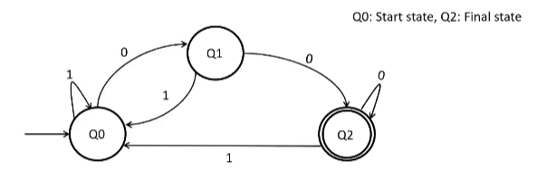

# Introduction
## Models of Computation
We will consider how various systems can act as models of computation, and find out their limits (the computational problems we can or cannot solve using that model). Note that we will consider all problems as decision problems only.

## Examples
* Consider a computational device $M$ running a sort of master algorithm, that takes in a C program $P$ and an input $x$, and outputs whether $P$ terminates on $x$ or not.  
    It is provable that such an algorithm cannot exist.  

* Consider the problem of determining if a polynomial $P(x,y)$ has integral roots or not. If it proceeds by an ordinary search through the set of integers, it can never output NO.  
    It can be shown that this problem, too, cannot be decided in finite time.
    
## Terminology
An *alphabet* is any finite, non-empty set of symbols.  

A finite sequence of symbols from an alphabet is a a *string* or a *word* over the alphabet.  

A *language* is a set of strings over an alphabet.

# Models of Computation
## Deterministic Finite Automata
The first model of computation is a deterministic finite automaton (DFA). It has a single start state $q_0$, unique transitions (given the input), and zero or more final states.  
DFAs are examples of finite state machines. Their operation can be represented using finite state diagrams, representing their states and the transitions among them.

The input string is taken in one by one, and the state transitions are made. For example, the string 0110000 would put the DFA shown into the $q_2$ state, which is an accepting state (double circle). Thus we say that this DFA accepts the input 0110000.  

The language a DFA $M$ accepts is simply the set of strings that it accepts.  

A finite automaton $M$ is formally defined as a 5-tuple $(Q, \Sigma, \delta, q_0, F)$, where

* $Q$ is a finite set (the states)
* $\Sigma$ is a finite set (the alphabet)
* $\delta : Q \times \Sigma \to Q$ is the transition function
* $q_0 \in Q$ is the start state
* $F \subseteq Q$ are the accepting states

## Non-Deterministic Finite Automata
An NFA, like a DFA, has a single start state and zero or more final states. However, they may have any number of transitions for a given state and a given input, including 0. There might also be $\epsilon$-transitions (transitions without any input).  

Thus, a nondeterministic finite automaton $M$ is formally defined as a 5-tuple $(Q, \Sigma, \delta, q_0, F)$, where

* $Q$ is a finite set (the states)
* $\Sigma$ is a finite set (the alphabet)
* $\delta : Q \times \Sigma \to \mathcal{P}(Q)$ is the transition function
* $q_0 \in Q$ is the start state
* $F \subseteq Q$ are the accepting states

Clearly, all DFAs are NFAs, but not vice versa. Counterintuitively, however, NFAs are *not* more powerful than DFAs – they accept exactly the same set of languages.
