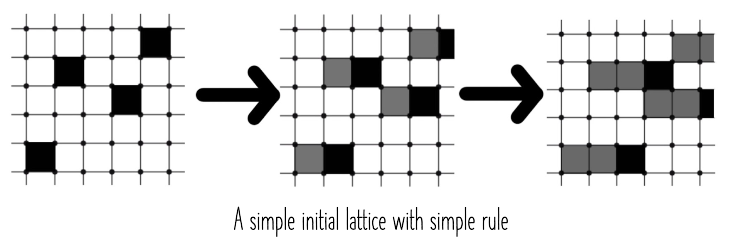

# Cellular Automata
Cellular automata are systems capable of changing state on their own, based on an initial state and a set of rules.  

For example, consider a lattice where each cell can be black or white. Evolution is discrete and depends only on the current state – a white cell turns black if and only if the cell to the left of it is black, and black cells remain black.

To limit complexity, the rules for a certain cell are only allowed to involve itself and its neighbours.  

Some applications of cellular automata include pseudorandom number generators (by initialising with a seed and assigning a number to each state) and one-way functions (previous states cannot be determined from the current state). They are also used in simulations in the natural sciences.

## Conway's Game of Life
### Introduction
Conway's Game of Life is a special celullar automaton, with cells that can take two values. Its only input is its initial configuration; rules are applied simultaneously to all cells and each generation is a function of the previous generation.

### Rules
The rules of Life are:

* any live cell with < 2 live neighbours dies
* any live cell with 2 or 3 live neighbours stays alive
* any live cell with > 3 live neighbours dies
* any dead cell with exactly 3 live neighbours comes alive.

### Evolution
There are various kinds of patterns that arise from these rules: still lifes (do not change from their initial configuration); oscillators (return to the seed after some iterations); spaceships (translate across the grid).  

Life is both Turing complete and undecidable.
