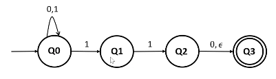
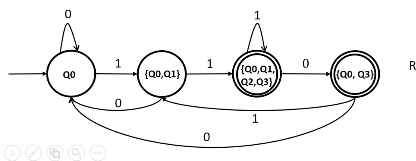
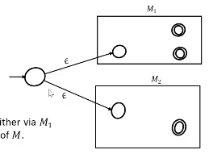
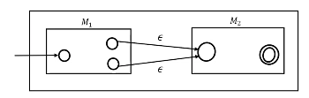
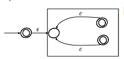
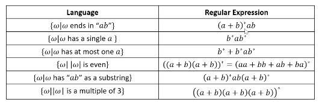

# Non-Deterministic Finite Automata (contd.)
Given any NFA, we can build a DFA that accepts the exact same language. The intuition behind this construction is that the DFA we construct has states that keep track of the *set of states* the NFA could be in at the same point. Thus the DFA can use up to $2^k$ states to simulate an NFA with $k$ states.

The given NFA accepts all strings ending with `11` or `110`. It can conveniently be converted to the DFA shown (note that not all subsets of states are present in the final DFA). Such a DFA is called a *remembering DFA*.

All subset of states containing an accepting state in the NFA become an accepting state in the remembering DFA.  

## Regular Languages
A language is called a regular language iff there exists some finite automaton recognising it. If $M$ is a finite automaton and
$$L(M) = \{\omega \mid \omega \text{ is accepted by } M\},$$
then $L(M)$ is regular.  

### Regular Operations
*Regular operations* on languages comprise the following:

* Union: $L_1 \cup L_2 = \{x \mid x \in L_1 \vee x \in L_2\}$
* Concatenation: $L_1 \cdot L_2 = \{xy \mid x \in L_1 \wedge y \in L_2\}$
* Star: $L^ * = \{x_1 x_2 \cdots x_k \mid k \geq 0, x_i \in L\}$

Note that the empty string $\varepsilon \in L^*$ for any language $L$.  

### Closure
It is provable that the set of regular languages $Q$ is closed under all three regular operations.  

#### Union

For the union of two languages $L_1$ and $L_2$, suppose that we have DFAs (or NFAs) $M_1$ and $M_2$ that accept them. We will construct an NFA $N$ that accepts $L_1 \cup L_2$. This NFA has $\varepsilon$-transitions from its start state to the start states of $D_1$ and $D_2$.

#### Concatenation

For the concatenation of $L_1$ and $L_2$, we construct $N$ by adding $\varepsilon$-transitions from *all* final states of $M_1$ to the start state of $M_2$.

#### Star

For the star of a language $L$ that is accepted by a DFA (or an NFA) $M$, it appears that we can simply add $\varepsilon$-transitions from the final states back to the start state of $M$. However, this does not accept the empty string. For this, we must add a new start state which is *also* a final state, with an $vareps$-transition to the original start state.

#### Complement

Consider the complement of $L$, $\overline{L}$. If we have a *DFA* $M$ that accepts $L$, we can change all the final states to non-accepting states and vice versa, to get the corresponding *toggled* DFA $M'$. This machine accepts $\overline{L}$.  

However, if $N$ is an NFA that accepts $N$, the toggled NFA $N'$ does not accept $\overline{L}$. Consider a string $x$ which has both an accepting and a rejecting run on $N$. It will therefore have both a rejecting and an accepting run on $N'$, which means it is accepted by $N'$, which is a contradiction.

#### Intersection

We can see that since $Q$ is closed under union and complement, it is also closed under intersection:
$$\begin{split}
L_1, L_2 &\in Q \\
\overline{L_1}, \overline{L_2} &\in Q \\
\overline{L_1} \cup \overline{L_2} &\in Q \\
\overline{L_1 \cap L_2} &\in Q \\
L_1 \cap L_2 &\in Q. \end{split}$$  

The closure properties of $Q$ give us an alternate, recursive definition for it:

* the empty language $\Phi$ is regular
* $\{ a\}$ is regular for all $a \in \Sigma$
* for all regular languages $L_1$, $L_2$ and $L$, $L_1 \cup L_2$, $L_1 \cdot L_2$ and $L^*$ are regular.

### Regular Expressions
A regular expression is an algebraic description of a regular language. They have the following syntax:

* $\Phi$ is a regular expression; $L(\Phi) = \Phi$.
* $\varepsilon$ is a regular expression; $L(\varepsilon) = \{\varepsilon\}$.
* for regular expressions $R_1$ and $R_2$, $R_1 + R_2$ is a regular expression; $L(R_1 + R_2) = L(R_1) \cup L(R_2)$.
* for regular expressions $R_1$ and $R_2$, $R_1 R_2$ is a regular expression; $L(R_1 R_2) = L(R_1) \cdot L(R_2)$.
* for a regular expression $R$, $R^*$ is a regular expression; $L(R^*) = L(R)^*$.

A language $L$ is regular iff for some regular expression $R$, $L(R) = L$. From the above rules and the proofs of closure, we can construct an NFA from any given regular expression.

Regular expressions have the following algebraic properties:

* $R_1 + (R_2 + R_3) = (R_1 + R_2) + R_3$
* $R_1(R_2 R_3) = (R_1 R_2) R_3$
* $R_1 (R_2 + R_3) = R_1 R_2 + R_1 R_3$
* $(R_1 + R_2) R_3 = R_1 R_3 + R_2 R_3$
* $R_1 + R_2 = R_2 + R_1$
* $R_1^* R_1^* = R_1^*$
* $(R_1^*)^* = R_1^*$
* $R\varepsilon = \varepsilon R = R$
* $R\Phi = \Phi R = R$
* $R + \Phi = \Phi$
* $\varepsilon + RR^* = \varepsilon + R^*R = R^*$ -> derive
* $(R_1 + R_2)^* = (R_1^* R_2^*)^* = (R_1^* + R_2^*)^*$
