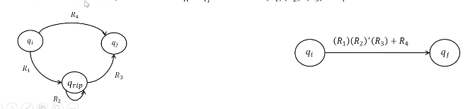

# Models of Computation
## Non-Deterministic Finite Automata (contd.)
### Converting DFAs to Regular Expressions
We define a *generalised NFA* as an NFA with regular expressions on its transitions rather than single characters. Starting from a DFA we construct a GNFA with two states and the required regular expression on its only transition.  

We begin by adding a new start and end state to the DFA, with $\varepsilon$-transitions. Each subsequent step reduces the number of states in the GNFA by one.  
Pick any state except the start or end states; call it $q_\text{rip}$. We remove this state and "repair" its loss by adding new arrows that account for all arrows starting from and ending at $q_\text{rip}$.

  

### The Pumping Lemma
We know that:

* $L$ is a regular language
* There is a DFA $D$ such that $L(D) = L$
* There is an NFA $N$ such that $L(N) = L$
* There is a regular expression $R$ such that $L(R) = L$

are all equivalent.  

Not all languages are regular, however. One non-regular language is $L = \{0^n1^n \mid n \geq 0\}.$  

If $L$ is a regular language, all strings in it longer than a certain length can be pumped (a section in it can be repeated an arbitrary number of times). More formally, the Pumping Lemma states that there exists a number $p$ (the pumping length) where for all $s \in L$ such that $|s| \geq p$, there exist $x, y, z$ such that $s = xyz$ and:

* $|xy| \geq p$
* $|y| \geq 1$
* $\forall i \geq 0, xy^iz \in L$

To prove this, consider a DFA $M$ of $p$ states. Then some states are repeated in any run for a string of length at least $p$.  
Let $r_1, \dots, r_{n+1}$ be the states encountered in the run for a string $s_1s_2\dots s_n$, $n \geq p$. Two states must be repeated; let these be $r_i = r_j, i < j$.  
Then we split $s$ into $x = s_1 \dots s_{i-1}$; $y = s_i \dots s_{j-1}$ and $z = s_j \dots s_n$. Then $y$ can be repeated or removed without changing the acceptability of $s$.

## Grammars
### Definition
Grammars provide a way to generate strings, rather than just parse them. The set of strings generated by a grammar is called the language of the grammar.  
Grammars consist of a set of rules that allow one to construct strings belonging to their language. For example,
$$\begin{split}
\text{S} &\to \text{Subj Verb Obj} \\
\text{Subj} &\to \text{NP} \\
\text{Obj} &\to \text{NP} \\
\text{NP} &\to \text{Art Noun} \mid \text{Noun} \\
\text{Art} &\to \text{the} \\
\text{Noun} &\to \text{boy} \mid \text{girl} \mid \text{soccer} \mid \text{poetry} \\
\text{Verb} &\to \text{loves} \mid \text{plays}. \end{split}$$

Formally, a grammar $G$ is a 4-tuple $(V, \Sigma, P, S)$, where

* $V$ is the set of variables
* $\Sigma$ is the set of terminals (disjoint from $V$)
* $P$ is the set of rules ($(V \cup \Sigma)^* V (V \cup \Sigma)^* \to (V \cup \Sigma)^*$)
* $S \in V$ is the start variable (usually in the LHS of the first rule).

The sequence of substitutions using the rules of $G$ that are required to obtain a certain string is called a *derivation*. A derivation shows that the string belongs to the language of $G$. The fact that $w$ can be derived is written as $S \xRightarrow[*] w$; hence we can define the language of $G$ as $L(G) = \{w \mid S \xRightarrow[*] w\}.$  

If the rules of the grammar all have the form
$$\begin{split}
V &\to \text{Ter } V \\
V &\to \text{Ter} \\
V &\to \varepsilon, \end{split}$$
then the grammar is called a right-linear grammar and the language of the grammar is regular.

### Linear Grammars
To convert a right-linear grammar to a DFA, make each variable a state and each terminal to its left a transition leading to it from the state corresponding to the variable on the LHS. A derivation in a linear grammar is analogous to a run in a DFA.  
To go other way, we can write a variable for each state and a rule for each arrow.  

Analogously, we can define left-linear grammars, which turn out to be equivalent to right-linear grammars.
