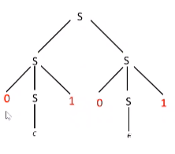

# Models of Computation
## Grammars (contd.)
### Context-Free Grammars
A context-free grammar is one in which all the rules are of the form $V \to (V \cup T)^*$ A language generated by such a grammar is called a context-free language.  
We see immediately that right- and left-linear grammars are special cases of context-free grammars.  

The language $\{0^n1^n\}$, which we have seen is not regular, is a context-free language. It can be generated by a grammar with two rules:
$$S -> 0S1 \mid \varepsilon$$

Consider the grammar $G$ with the rules
$$S \to 0S1 \mid SS \mid \varepsilon$$

Some strings generated by this grammar are $\{\varepsilon, 01, 0011, 0^n1^n, 001011, 010101, \dots\}$.  
If we replace 0 with `(` and 1 with `)`, we can see that $L(G)$ is the language of all strings of properly nested parentheses.  

A parse tree is an ordered tree that provides an alternative variation of the derivation of a grammar.

A grammar is called ambiguous if any string in its language has two or more leftmost (or rightmost) derivations. Equivalently, it should have two or more parse trees.  
Since programming languages' syntax can be represented by CFGs, ambiguity is important in the study of PLs.  

A *language* L' may be inherently ambiguous if all grammars $G$ such that $L(G) = L'$ are ambiguous.
