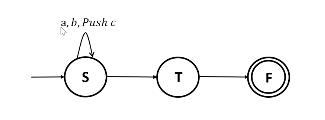
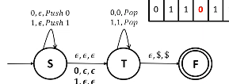

# Models of Computation
## Grammars
### Pushdown Automata (contd.)
PDAs are non-deterministic automata. Multiple transitions per input symbol are possible.  

Transitions are represented by listing the input symbol, the stack top and the stack operation to be executed. For example, if the automaton pushes a `c` and remains in state `S` when it receives input `a` and the stack top is `b`, then the transition is represented as in the figure.

  

Note that the stack operations can involve pushing more than one character, but popping only once.  

Formally, a PDA is a 6-tuple $(Q, \Sigma, \Gamma, \delta, q_0, F)$, where

* $Q$ is a finite set of states
* $\Sigma$ is a set of input alphabets
* $\Gamma$ is the stack alphabet
* $\delta : Q \times \Sigma_\varepsilon \to \mathfrak{P}(Q \times \Gamma_\varepsilon)$
* $q_0 \in Q$ is the start state
* $F \subseteq Q$ is the set of accepting states.  

For example, if $\delta(q_i, a, b) = \{(q_j, c)\}$, it is to be interpreted as: if the input symbol is `a` and the stack top is `b`, then pop `b`, push `c` onto the stack and transition from $q_i$ to $q_j$.  

The language of a PDA $P$ is the set of strings that it accepts.  

The nondeterminism of PDAs becomes evident when we try to design one to recognise $L = \{w \in \Sigma* \mid w \text{ is a palindrom}\}$, where $\Sigma = \{0,1\}$. We want to push the first half of inputs on the stack, and pop as we read every remaining character. However, we don't know where the midpoint of the input is. Thus, we can non-deterministically guess at each point (*i.e.* transition to a different state with no pushing, popping or reading) and try.  
This will only work for even-length palindromes, however. Therefore the guessing transition might need to read a single character.  

