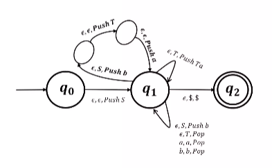

# Models of Computation
## Grammars
### Pushdown Automata (contd.)
We will now prove that if a language $L$ is context free, there exists a PDA that recognises $L$. The proof consists of using the rules of the CFG to build a PDA so that it can simulate any derivation $S \implies w$.  

Intuitively, the PDA begins by pushing the start variable $S$ on the stack. Then, if the top of the stack is any variable $A$, it nondeterministically selects a rule $A \to x$, pops $A$ and pushes $x$ on the stack.  
If the top of the stack is some terminal $a$, read the input symbol, and if they match, pop $a$.  

The actual construction of the PDA involves three main states. At the start state, we push the start variable and move to the second state. At the second state, we have self-loops for all the rules (possibly involving intermediate states). Finally, an empty stack lets the automaton move to the third and final state.  

For example, see the figure for a PDA corresponding to the grammar $G$, whose rules are
$$\begin{split}
S &\to aTb \mid b \\
T &\to Ta \mid \varepsilon \end{split}$$

  

We can prove that this construction produces an equivalent PDA by showing that it can simulate any derivation.  

### Deterministic PDA
Deterministic pushdown automata can also be defined, although slightly differently from DFAs. In a deterministic PDA, for every $q \in Q, a \in \Sigma, x \in \Gamma$, exactly one of the following values is non-empty: $\delta(q, a, x), \delta(q,a,\varepsilon), \delta(q,\varepsilon, x), \delta(q, \varepsilon, \varepsilon)$.

Note that DPDAs are strictly less powerful than PDAs; deterministic CFLs (DCFLs) are a strict subset of CFLs. However, parsers corresponding to DPDAs are efficient – the membership problem can be decided in $O(n)$ rather than $O(n^3)$.
