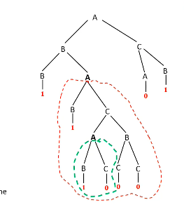

# Models of Computation
## Grammars
### The Pumping Lemma for CFLs
All CFLs satisfy the pumping lemma. Its basic principle, as in the case of regular languages, is that in order to recognise long strings, some steps of computation must be repeated.  

Consider the grammar
$$\begin{split}
A &\to BC \mid 0 \\
B &\to BA \mid 1 \mid CC \\
C &\to AB \mid 0 \end{split}$$
and the string $w = 11100001$. Consider the longest path in its parse tree. Its length is 6, which is more than $|V| = 3$, which means that some variable appears more than once in this path. In this case it is $A$; let us replace the last occurrence of $A$ with the subtree under its first occurrence. The resulting string must also belong to $L$.  
In this case, we get $w' = 11110000001$. This procedure can be repeated indefinitely.  

In general, if $L$ is a CL, then there exists a length $p$ such that every $w \in L$ such that $|w| \geq p$ can be divided as $w=uvxyz$ such that $|vxy| \leq p$, and for all $i \geq 0,$ $w_i = uv^i xy^i x \in L$.  
Intuitively, $x$ is the subtree under the lowest occurrence of the repeating variable, and $vxy$ the subtree under the highest one. Replacing the former with the latter once clearly gives us $uv^2xy^2z,$ and so on for any number of replacements.  

For any CFL $L$, let $w \in L$ and $L = \mathfrak{L}(G)$. Consider a parse tree $T^G_w$ of $w$ in $G$.  
If $d$ is the maximum number of variables in the RHS of any rule of $G$, $T^G_w$ is a $d$-ary parse tree. Thus, at level $l$, it has at most $d^l$ nodes, which implies that any $T^G_w$ of height $h$ has at most $d^h$ terminals.  

Now, if $|V|$ is the total number of variables, we can let $p = d^{|V|+1}$. Then the parse tree must have height $\geq |V| + 1$. Therefore the longest path has at least $|V|+1$ variables, in which at least one variable must be repeated. Thus we can let this $p$ be the pumping length.  

In the case of ambiguous derivations, we pick the smallest parse tree. This leads to the additional condition that $|vy| \leq 1.$ If they were both empty, $w = uxz$ gives another parse tree for $w$ that is smaller than the original, which we disallow.

### Closure Properties of CFLs
If $G_1$ and $G_2$ are grammars such that $L(G_1) = L_1$ and $L(G_2) = L_2$, and they are of the form
$$S_1 \to \dots$$
and
$$S_2 \to \dots$$
respectively. Then if $G$ starts with the rule
$$S \to S_1 \mid S_2$$
and then has all the rules of $G_1$ and $G_2$, $L(G) = L_1 \cup L_2$. Hence CFLs are closed under union.  

If we have $L(G) = L$ with start variable $S_1$, we can define $L'$ with grammar whose rule starts with
$$S \to S_1 S \mid \varepsilon,$$
in which case $L = L^*$. Thus CFLs are closod under the Kleene star operation.  

However, CFLs are *not* closed under intersection. Consider the counterexample of $L_1 \{0^n1^n2^m \mid m, n \geq 1\}$ and $L_2 = \{0^m1^n2^n \mid m, n \geq 1\}$.  

Now, we can use the above results to show that CFLs are *not* closed under complementation. If they were, suppose that $L_1$ and $L_2$ are CFLs. This would mean that $\overline{L_1} \cup \overline{L_2}$ is a CFL. But this is just $\overline{L_1 \cap L_2}$; thus $L_1 \cap L_2$ is also a CFL. But this, as we have seen, may not be true.  

We can, however, show that if $L$ is a CFL and $R$ is regular, then $L \cup R$ and $L \cap R$ are CFLs. The proof relies on what can be called a *product PDA* $X$, whose states are labelled $(q_i, d_j)$ for all $q_i \in Q_L$ and $d_j \in Q_R$. Formally, if $\delta (q_i, a, b) = (q_j, c)$, and $\delta(d_k, a) = d_l$, for $L$ and $R$, then $\delta((q_i, d_k), a, b) = ((q_j, d_l), c)$ for $X$.  

We state without proof that DCFLs are not closed under union or intersection, but they are closed under complementation.
