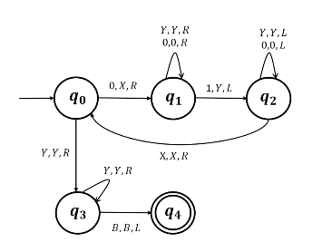

# Models of Computation
## Turing Machines
Turing machines are a mathematical abstraction of computing devices.  
They are FSMs that have access to memory in the form of an infinite tape, which contains the input string followed by blanks.  
A TM has a read-write head that can both read from and write to the tape. It can move to the left or right one cell at a time. When the computation reaches an accept/reject state, it halts and accepts or rejects the input string.  

A transition in a TM, therefore, has three elements – what is to be read, what is to be written, and whether the head is to move left or right.  

Note that a certain TM may never halt on a certain input.  

Turing claimed that Turing machines could simulate anything "humanly computable"; he considered a human brain as an FSM.

Formally, a Turing machine is a 7-tuple $(Q, \Sigma, \Gamma, \delta, q_0, q_\text{accept}, q_\text{reject})$, where

* $Q$ is a finite set called the states.
* $\Sigma$ is the set of input alphabtes not containing the blank symbol $B$.
* $\Gamma$ is the tape alphabet, where $B \in \Gamma$ and $\Sigma subseteq \Gamma$.
* $\delta : Q \times \Gamma \to Q \times \Gamma \times \{L, R\}$ is the transition function.
* $q_0 \in Q$ is the start state.
* $q_\text{accept} \in Q$ is the accept state.
* $q_\text{reject} \in Q - \{q_\text{accept}\}$ is the reject state.

A *configuration* of a TM consists of the current tape contents, the current state and the current head location. At each step, the configuration changes; we say that $C_1$ yields $C_2$ if the TM goes from $C_1$ to $C_2$ in one step.  

A TM $M$ accepts $w$ if there exists a sequence of configurations $C_1, \dots, C_k$, where $C_1$ is the start configuration, each $C_i$ yields $C_{i+1}$, and $C_k$ is an accepting configuration. The language of a TM $M$ is $L = \{w \mid M \text{ accepts } w\}$.
