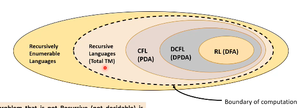

# Models of Computation
## Turing Machines (contd.)
The languages recognised by computing devices (Turing machines) are superset of CFLs.  

A TM $M$ is *total* if for all input strings $w \in \Sigma^*$, $M(w)$ either accepts or rejects but never runs indefinitely (*i.e.*, $M$ always halts).  
A total Turing machine is simply a formalism for an algorithm.  

### Decidable and Recognisable Languages
Languages that are accepted by total TMs are called recursive, Turing decidable, or simply decidable.  

A superset of these are the recursively enumerable languages, or Turing recognisable languages, which are accepted by TMs that accept strings in the language and *do not accept* (reject or run indefinitely on) strings not in the language.  
The set of complements of recursively enumerable languages is called co-recursively enumerable languages or co-Turing recognisable languages.  

Any problem that is not recursive is called undecidable – there exists some input $w$ on which the TM loops forever. Since RE is a strict superset of recursive languages, there are some RE languages that are undecidable.  

Undecidable languages can be partially decidable (the TM loops infinitely for at least one *no* instance) or completely undecidable (if it is undecidable and *not* partially undecidable, *i.e.*, the TM loops infinitely for at least one *yes* instance).

### Variants of Turing Machines
We will see that some changes can be made to the formalism representing a Turing machine that seemingly make it more powerful, but in fact do not change its language class.  

The first variation we will consider is allowing the head of the TM to stay put in addition to moving left or right, which we call a *lazy* TM. Its transition function thus has the form $\delta : Q \times \Gamma \to Q \times \Gamma \times \{L, R, S\}$.  
Clearly a lazy TM can simulate a standard one; the reverse is also possible by adding dummy states for lazy transitions, which enable the TM to move right and then left again.  

Next, consider TMs with $k$ read-write tapes instead of one, each with its own head. The transition function is now $Q \times \Gamma^k \to Q \times \Gamma^k \times \{L, R\}^k$.  
Again, simulating a standard TM with a $k$-TM is trivial. In the reverse direction, we store the contents of all $k$ tapes on the single tape, separating them using a delimiter symbol, say \$. We also have a special mark, say \_, to mark the cells where the heads are at any moment. To simulate the $k$-TM, it scans the tape completely to find the locations of the "heads", and then makes a second pass to update them according to $\delta$. If one of them needs more cells, the tapes to the right can be shifted.  

Now, we look at TMs with two-way infinite tapes. The tape extends infinitely in both directions from the starting cell.  
As before, simulating a standard TM with this is simple. To simulate a two-way TM with a standard one, we can split this tape into two one-way infinite tapes, and simulate this new machine as we proved in the previous case.  

Finally, non-deterministic TMs (NTMs) can be shown to be equivalent to deterministic TMs (DTMs). At any point in the computation, several possible configurations are possible. The transition function has the form $\delta : Q \times \Gamma \to \mathcal{P}(Q \times \Gamma \times \{L, R\})$. The computation is represented by a tree, rather than a straight line.  
As usual, an NTM simulating a DTM is simple. However, a DTM can also simulate an NTM by carrying out a DFS on the computation-tree, searching for an accepting configuration. However, some branches may be infinitely long, causing the DTM to miss a shorter accepting configuration.  
We use a 3-tape TM to solve this. The first tape stores the input string $w$; the second generates runs lexicographically (see below); and the third simulates the run on input $w$. To generate runs, let $\Sigma = \{1, 2, \dots, b\}$, and consider $s \in \Sigma^*$. Say $s = 122$; then what it means is that we pick node 1 at level 1, node 2 at level 2, and node 2 at level 3 of the computation-tree. Note that some of these runs may be invalid or too short to lead to any accept or reject state.  

Let $DT(n)$ be the number of steps that a certain DTM takes to halt on an input of size $n$, and let $NT(n)$ be the analogous function for NTMs. The set of all problems for which $DT(n)$ is a polynomial in $n$ is called **P**, and the set of those for which $NT(n)$ is a polynomial is called **NP**.
