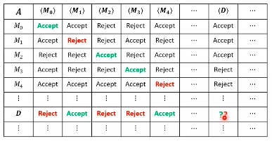

# Models of Computation
## Turing Machines (contd.)
### Enumerators
An enumerator is simply a TM attached with a printer. It is equipped with an additional *print tape* which it uses to output strings.  
The language of an enumerator $E$ (the language it *enumerates*) is the set of strings that it prints out. If it does not halt, it may print infinitely many strings in some order.
$$L(E) = \{w \in \Sigma^* \mid w \text{ is printed by } E\}.$$

A language $L$ is recursively enumerable (or Turing recognisable) iff some enumerator enumerates it. Further, a language $L$ is recursive (or Turing decidable) iff some enumerator enumerates it *in lexicographic order*.  

### Encoding
The input to a TM is often in the form of a string or a sequence of strings. Thus, when we want to pass bigger objects to them (like numbers, graphs, CFGs, or even TMs), we need to *encode* them as strings in order to pass them. For instance, we can have a TM $M$ with the following behaviour:
$$\begin{split}
M(\langle M_1 \rangle, w) = &\text{Run } M_1 \text{ on input } w \\
&\text{If } M_1(w) \text{ accepts, accept;} \\
&\text{If } M_1(w) \text{ rejects, reject.} \end{split}$$

Such a TM, which simulates other TMs, is called a *universal* TM. Note that $\langle X \rangle$ denotes the encoding of any object $X$ as a string.  

As a concrete example of how to encode a DTM as a binary string, consider the following. Let $Q = \{q_0, \dots, q_{m-1}\}, \Sigma = \{0, \dots, k-1\}, \Gamma = \{0, \dots, n-1\}$, where $\Sigma \subseteq \Gamma$ and therefore $k \leq n$. WLOG, let $B$ correspond to the last symbol $n-1$ in $\Gamma$.  

Any state $q_i \in Q$ can be encoded as a binary string by taking the binary representation of $i$. Analogously, we can encode symbols in $\Sigma$ and $\Gamma$.  
We can also let $\langle L \rangle = 0, \langle R \rangle = 1$. Then we can denote the transition function $\delta(q_i, a) = (q_j, b, L/R)$ as $\langle \langle q_i \rangle, \langle a \rangle, \langle q_j \rangle, \langle b \rangle, \langle L/R \rangle \rangle$. We list out all the transitions in lexicographic order.  

Following this encoding we can encode the TM as
$$\langle M \rangle = (\langle m \rangle, \langle k \rangle, \langle n \rangle, \langle \Gamma \rangle, \langle \delta \rangle, 0, \langle q_\text{accept} \rangle, \langle q_\text{reject} \rangle).$$

We now only need a way to unambiguously encode tuples in binary. We can do this by using a delimiter (which we call $\#$ for now):
$$(\langle a_1 \rangle, \cdots, \langle a_n \rangle) = \langle \langle a_1 \rangle \cdots \langle a_n \rangle \rangle,$$
and then using the mapping
$$\begin{split}
0 &\to 00 \\
1 &\to 01 \\
\# &\to 1 \end{split}$$
It is easy to show that this mapping gives us an unambiguous demarcation among the $a_i$.  

Now we know that $\langle M \rangle \in \{0, 1\}^*$ for any TM $M$. This means that not all binary strings are valid descriptions of TMs. In order to make this a bijection, we can lexicographically generate binary strings, and relabel the descriptions of TMs in lexicographical order with them. In other words, the first string that corresponds to a valid TM is relabelled as 0; the next as 1; and so on.  
Note that this shows that the number of TMs that exist is countably infinite.  

Using this encoding (or any other, as a matter of fact), we can (but won't) provide a full definition of a universal Turing machine $U_\text{TM}$. Now, since the $U\text{TM}$ is total (as the encoding of TMs as strings is bijective), we are in a position to talk about Turing machines which answer questions about *other* TMs (or any other computational device).  

### Some Decidable Languages
Consider the language
$$A_\text{DFA} = \{ \langle D, w \rangle \mid w \in L(D)\},$$
where $D$ is a DFA. This is decidable as we can simulate $D$ on $w$ and output whatever the output of $D$ is.  

Then consider
$$E_\text{DFA} = \{ \langle D \rangle \mid L(D) = \Phi\}.$$
This can be done by first marking the start state of the DFA $D$, and then marking any state that has an incoming transition from a marked state. Repeating this procedure, we can mark all states that are reachable; if the final state is then unmarked, accept; else reject.  

Thirdly, let us look at
$$A_\text{CFG} = \{ \langle C, w \rangle \mid w \in L(C)\},$$
where $C$ is a CFG. This can be decided by converting $C$ into CNF, and listing all derivations of $2|w|-1$ steps. If any of them yield $w$, accept; else reject.  

Next, we have
$$E_\text{CFG} = \{ \langle C \rangle \mid L(C) = \Phi\}.$$
This can be done analogously to the way $E_\text{DFA}$ was decided. Mark all terminal symbols, and mark all variables which lead to marked symbols. Repeat until no more variables are marked. Then if the start variable $S$ is marked, accept; else reject.

### Some Undecidable Languages
Consider
$$A_\text{TM} = \{ \langle M, w \rangle \mid M \text{ accepts } w \},$$
where $M$ is a TM. Note that the TM $A$ that we need should accept if $M(w)$ accepts, and reject if $M(w)$ either rejects or loops infinitely. We can show by contradiction that such a TM cannot exist.  

Assume that $A$ exists. Then we can construct a machine $D$ which takes input $w$ and runs $A$ on $\langle w, w \rangle$; its behaviour is as follows:
$$\begin{split}
D(w) = &\text{Run } A(\langle w, w \rangle) \\
&\text{If } A(\langle w, w \rangle) \text{ accepts, reject;} \\
&\text{If } A(\langle w, w \rangle) \text{ rejects, accept.} \rangle \end{split}$$

Note that effectively,
$$D(\langle M \rangle) = \begin{cases}
\text{accepts} & \text{if } M(\langle M \rangle) \text{ doesn't accept;} \\
\text{rejects} & \text{if } M(\langle M \rangle) \text{ accepts.} \end{cases}$$
But if we run $D$ on $\langle D \rangle$, it accepts if it doesn't accept; and it rejects if it accepts. This is clearly not possible; thus $D$ cannot exist, which means that $A$ cannot exist.  

Of course, $A_\text{TM}$ is recursively enumerable (or partially decidable).  

This proof uses a technique called diagonalisation. Imagine a table between Turing machines and their encodings, and consider $A(i,j)$ for each row $i$ and each column $j$ of the table. We coonstructed a TM which outputs the opposite of the diagonal cells of the table; therefore its own diagonal cell cannot exist.

